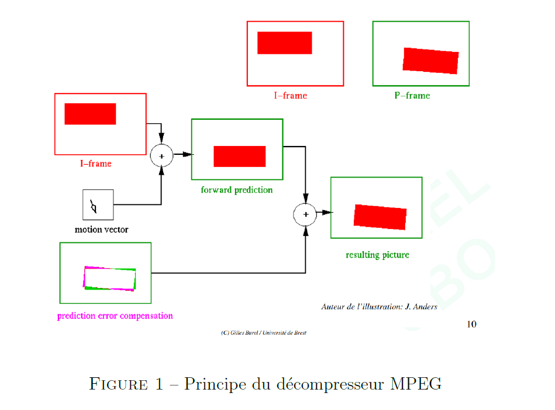
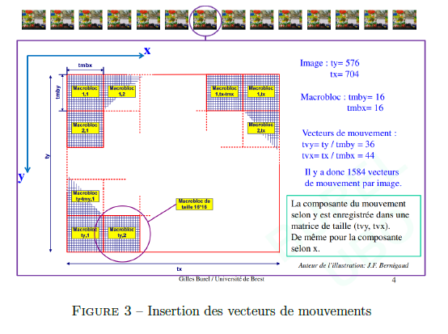
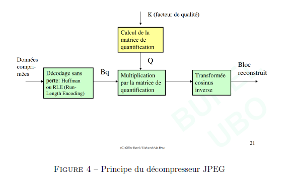
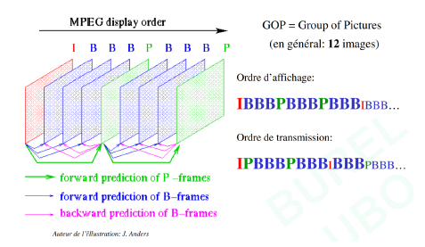
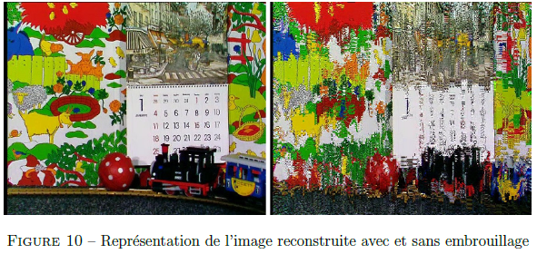
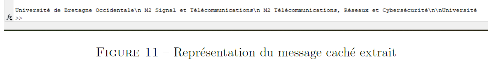

# MPEG Video Compression, Scrambling and Watermarking in MATLAB

A MATLAB implementation of a simplified MPEG-style video processing pipeline, including **video decompression**, **motion compensation**, **motion-vector scrambling/descrambling**, and **watermark extraction**.

The project focuses on the core mechanisms behind MPEG video reconstruction and video protection techniques.

## Overview

This project reconstructs a compressed video sequence from MPEG-like data using:

- JPEG-like decompression with dequantization and inverse DCT
- I-frame and P-frame reconstruction
- Motion compensation using motion vectors
- Error-frame correction
- Motion-vector scrambling for visual protection
- Descrambling using a secret key
- Hidden message extraction from motion vectors

**Main entry point:**

```text
src/mpeg_project.m
```

## Visual Overview

The figures below are extracted from my project report.  
The report itself is not included in this repository.

### MPEG Decompression Pipeline



The MPEG reconstruction process uses reference frames, motion vectors, predicted frames, and error frames.

```text
Reconstructed Frame = Predicted Frame + Error Frame
```

### Motion Vectors and Macroblocks



Motion compensation is performed block by block.

Each frame is divided into macroblocks, and each macroblock is reconstructed using a motion vector:

```text
Vx = horizontal displacement
Vy = vertical displacement
```

### JPEG-like Decompression



The JPEG-like decompression stage reconstructs image blocks using:

1. Dequantization  
2. Inverse Discrete Cosine Transform  
3. Chroma resizing  
4. YCbCr reconstruction  
5. RGB conversion for visualization  

```text
B = Bq × Q
```

where `Bq` is the quantized block and `Q` is the quantization matrix.

### GOP Structure



The video sequence is organized into Groups of Pictures:

```text
IPPPPPPPPPPP
```

This implementation uses:

- 1 I-frame  
- 11 P-frames  
- No B-frames  

### Scrambling and Descrambling



Scrambling is applied by perturbing the vertical component of motion vectors:

```text
Vy' = Vy + random(-f, f)
```

In this project:

```text
f = 8
```

Descrambling regenerates the same perturbation and subtracts it:

```text
Vy = Vy' - random(-f, f)
```

Without the correct key and parameters, the video cannot be correctly reconstructed.

### Watermark Extraction



The project extracts a hidden message embedded in motion vectors.

The extraction process:

1. Selects motion-vector positions using a secret key  
2. Compares marked vectors with reference vectors  
3. Recovers binary values  
4. Converts binary data into ASCII characters  

## Processing Pipeline

```text
Load MPEG data
        ↓
Reconstruct I-frames
        ↓
Predict P-frames using motion vectors
        ↓
Decompress error frames
        ↓
Reconstruct video frames
        ↓
Generate scrambled video
        ↓
Descramble motion vectors
        ↓
Generate descrambled video
        ↓
Extract hidden watermark message
```

## Repository Structure

```text
mpeg-video-compression-scrambling-matlab/
├── README.md
├── LICENSE
├── .gitignore
├── src/
│   ├── decomp.m
│   ├── dequantification.m
│   ├── EcrireVideo.m
│   ├── predite_embr.m
│   ├── predit_desembr.m
│   ├── mpeg_project.m
│   └── video.m
└── figures/
    ├── mpeg_decoder_pipeline.png
    ├── motion_vectors_macroblocks.png
    ├── jpeg_decompression_pipeline.png
    ├── gop_structure.png
    ├── scrambling_comparison.png
    └── hidden_message.png
```

## Source Files

| File | Role |
|------|------|
| `mpeg_project.m` | Main script for reconstruction, scrambling, descrambling, and watermark extraction |
| `video.m` | MPEG reconstruction script using scrambled motion vectors |
| `decomp.m` | Decompression function: dequantization, IDCT, chroma resizing, YCbCr reconstruction |
| `dequantification.m` | Applies dequantization using the quantization matrix |
| `predite_embr.m` | Predicts P-frames using scrambled motion vectors |
| `predit_desembr.m` | Predicts P-frames after descrambling motion vectors |
| `EcrireVideo.m` | Writes reconstructed frames to AVI video files |

## Required Data

The following MATLAB data files are required:

```text
videoMPEG.mat
TabVref.mat
```

These files are not included in the repository.

Place them in the project root:

```text
mpeg-video-compression-scrambling-matlab/
├── videoMPEG.mat
├── TabVref.mat
```

## Requirements

- MATLAB  
- Image Processing Toolbox  

Main MATLAB functions used:

```text
blkproc
idct2
imresize
ycbcr2rgb
im2frame
VideoWriter
rng
randi
randperm
bin2dec
```

## How to Run

```matlab
run('src/mpeg_project.m')
```

or:

```matlab
mpeg_project
```

## Outputs

Generated video files:

```text
video_embr.avi
video_desembr.avi
video_embrouillee.avi
```

These files are ignored by Git and not included.

## Implementation Notes

- Focus on MPEG reconstruction steps affecting visual quality  
- Lossless decoding (Huffman, RLE) is intentionally omitted  
- Scrambling modifies motion vectors, not pixel values  
- Watermark is extracted from motion vector differences  
- Figures are extracted from the project report (not included)  

## Author

Montassar Laboudi
